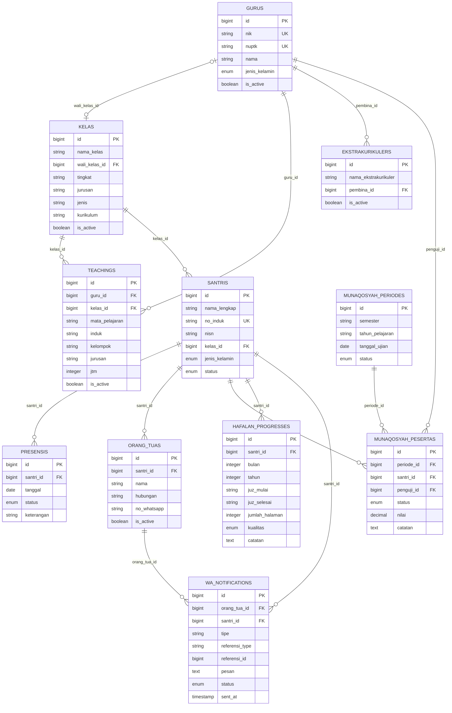

# ERD PPTQMMQ Digital

File utama yang dapat diedit di diagrams.net/draw.io: `erd-pptqmmq.drawio`.

## Mermaid

## Keterangan Untuk Bab 3

ERD sistem PPTQMMQ Digital menggambarkan struktur penyimpanan data dan hubungan antarentitas. Entitas `gurus` menyimpan data guru dan menjadi induk bagi entitas `kelas`, `teachings`, serta `ekstrakurikulers`. Entitas `kelas` menyimpan data kelas dan berhubungan dengan `santris` serta `teachings`. Entitas `santris` menjadi induk data presensi melalui `presensis`.

Hubungan yang ditampilkan sebagai garis utama pada diagram berasal dari foreign key pada migration Laravel. Kardinalitas `1:N` berarti satu data pada entitas induk dapat memiliki banyak data pada entitas anak, sedangkan data anak hanya mengacu pada satu data induk. Foreign key yang nullable, seperti `kelas.wali_kelas_id`, `santris.kelas_id`, dan `ekstrakurikulers.pembina_id`, memungkinkan data anak belum memiliki induk.

Tabel `mapels` belum memiliki foreign key langsung ke `teachings`; keterkaitan mata pelajaran masih disimpan melalui nilai teks `mata_pelajaran`. Tabel `raports`, `raport_kmis`, dan `raport_tokens` juga menyimpan identitas santri/kelas dalam bentuk teks, bukan foreign key. Oleh karena itu, tabel-tabel tersebut dicantumkan sebagai entitas pendukung tanpa garis relasi eksplisit agar ERD sesuai dengan struktur database aktual.

Tabel `users`, `sessions`, `password_reset_tokens`, `cache`, dan `jobs` merupakan tabel pendukung framework Laravel. Tabel konten publik `prestasis`, `penghargaans`, `testimonis`, `donasis`, serta `questions` berdiri sendiri karena tidak memiliki foreign key ke entitas lain.

### Fitur Munaqosyah, Hafalan, dan WhatsApp

Entitas `munaqosyah_periodes` menyimpan jadwal ujian munaqosyah berdasarkan semester dan tahun pelajaran. Setiap periode memiliki banyak data `munaqosyah_pesertas`. Entitas peserta menghubungkan periode dengan `santris`, serta dapat menyimpan penguji dari entitas `gurus`, status kelulusan, nilai, dan catatan hasil ujian.

Entitas `hafalan_progresses` menyimpan perkembangan hafalan setiap santri secara berkala, minimal satu catatan untuk setiap santri pada setiap bulan dan tahun. Kolom seperti juz awal, juz akhir, jumlah halaman, kualitas hafalan, dan catatan dapat digunakan untuk membentuk laporan progres bulanan.

Entitas `orang_tuas` menyimpan nomor WhatsApp wali/orang tua yang terhubung dengan santri. Entitas `wa_notifications` menyimpan pesan yang dikirim, jenis referensi (misalnya `hafalan_bulanan` atau `hasil_munaqosyah`), status pengiriman, waktu pengiriman, dan identitas orang tua penerima. Dengan demikian, sistem tidak hanya mengirim pesan, tetapi juga dapat menampilkan riwayat berhasil, gagal, atau menunggu.

Untuk implementasi aktual, pengiriman WhatsApp memerlukan layanan gateway/API WhatsApp. ERD ini memodelkan data penerima dan riwayat pengiriman; kredensial API sebaiknya disimpan di konfigurasi environment, bukan di tabel.

## Legenda

- `PK`: primary key.
- `FK`: foreign key.
- `UK`: unique key.
- Garis relasi utama: foreign key benar-benar didefinisikan pada migration.
- Keterkaitan teks/JSON: hubungan logis aplikasi, tetapi belum menjadi relasi database.
- `MUNAQOSYAH_PESERTAS`: tabel transaksi peserta dan hasil ujian per periode.
- `HAFALAN_PROGRESSES`: tabel transaksi progres hafalan bulanan per santri.
- `WA_NOTIFICATIONS`: tabel log pengiriman pesan ke orang tua/wali.
